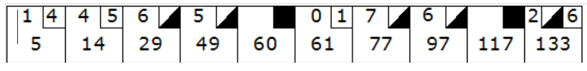

# Bowling Score
[A re-formatting of Uncle Bob's Bowling game kata.](http://butunclebob.com/ArticleS.UncleBob.TheBowlingGameKata)

The game consists of 10 frames as shown above.  In each frame the player has
two opportunities to knock down 10 pins.  The **score** for the frame is the **total**
number of pins knocked down, **plus bonuses** for strikes and spares.

A spare is when the player knocks down all 10 pins in two tries. The **bonus** for
that frame is the number of pins knocked down by the **next roll**.  So in frame 3
above, the score is 10 (the total number knocked down) plus a bonus of 5 (the
number of pins knocked down on the next roll.)

A strike is when the player knocks down all 10 pins on his first try.  The **bonus**
for that frame is the value of the **next two balls** rolled.

**In the tenth frame** a player who rolls a spare or strike is allowed to roll the extra
balls to complete the frame.  However no more than three balls can be rolled in
tenth frame.

## Requirements

Write some code that can take a sequence of rolls and compute the final score. It should satisfy
the following requirements;

- Given a valid sequence of rolls, calculate the correct score
- Given an invalid sequence, return an error.
- The code should be executable within the codepad to produce outputs.

## Sample Test Cases
These aren't exhaustive, just a place to start.

- 
